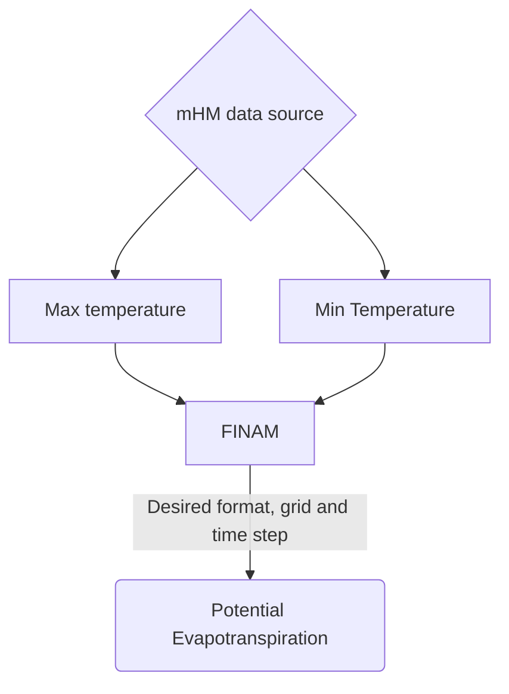

<h1>Estimation of potential evapotranspiration (PET) according to Hargreaves & Samani equation (1985).</h1>

## References:
1) George H. Hargreaves and Zohrab A. Samani (1985) ‘Reference Crop Evapotranspiration from air Temperature’, Applied Engineering in Agriculture, 1(2), pp. 96–99. doi: 10.13031/2013.26773.

2) John A. Duffie (Deceased) and William A. Beckman (2013). ‘Solar Engineering of Thermal Processes’. Fourth Edition. Solar Energy Laboratory University of Wisconsin-Madison.

## Files location
This example contains three main folders:
* All scripts are in `src` folder.
* Data files used are in `data` folder.
* Resulting scripts are stored in `results` folder.


## Description
* This example uses as input minimum and maximum temperature to estimate potential evapotranspiration (PET).
* PET is estimated for each grid cell and time step.
* Original minimum and maximum temperature input data come from a [test case](https://git.ufz.de/mhm/mhm/-/tree/develop/test_domain/input/meteo) in mHM model repository.
* Calculations at each grid cell and time step are based on Hargreaves-Samani Equation (1985).

## Estimation methodology

### Estimating potential Evapotranspiration (PET):

According to Hargreaves-Samani Equation (1985), PET is estimated as:
```math
ETP = ket * R_a* \sqrt{Tmax - Tmin} *(Tavg + 17.8)
```
Where:

- Tavg = Average dayly air temperature (°C), which for this example is approximated as:

```math
tavg = (Tmax - Tmin)/2
```

- ETP = Potential Evapotranspiration (mm ∕ day)
- Ket = calibration coefficient equal to 0.0023°C<sup>1.5</sup>
- R<sub>a</sub> = extraterrestrial radiation (mm ∕ day) - radiation received in the absence of the atmosphere
- Tmax =  daily maximum air temperature (°C)
- Tmin =  daily minimum air temperature (°C)

### Estimating extraterrestrial radiation (R<sub>a</sub>):
Furtheremore, extraterrestrial radiation (R<sub>a</sub>) needs to be calculated.
Based on Duffie & William, the following set of variables and equations can be used to calculate R<sub>a</sub>:

- Day of year = DOY
- Latitude given is degrees = lat

- Solar declination (δ)
```math
δ = 23.45° * sin( 360°/365 * (DOY+284))
```
- Sunset hour angle (W<sub>s</sub>)
```math
W_s = arccos(-tan(lat) * tan(δ) )
```
* Relative distance between sun and earth (d<sub>s</sub>)
```math
d_s = 1 + 0.033 * (cos(2\pi DOY/365))
```
* Extraterrestrial radiation (R<sub>a</sub>)
```math
R_a = 15.3351 * d_s * [W_s sin(lat)sin(δ)+ cos(lat)cos(δ)sin(ws)]
```
In this example, all angles used in trigonometric functions were converted into radians. In addition, δ data units (degree) were also converted to radians in order to use it in the calculation of W<sub>s</sub> and R<sub>a</sub>.

<br>

__________________________________
Input data needed:
Variable  | Input type
--- | --- |
Min_temperature | grid (.nc) |
Max_temperature | grid (.nc) |
__________________________________

___________________________________
 Output data Expected:
Variable  | Input type
--- | --- |
ETP | grid (.nc) |

___________________________________


## Code-block flow chart

<div class="center">


