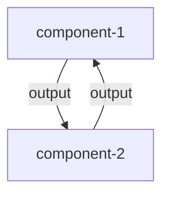
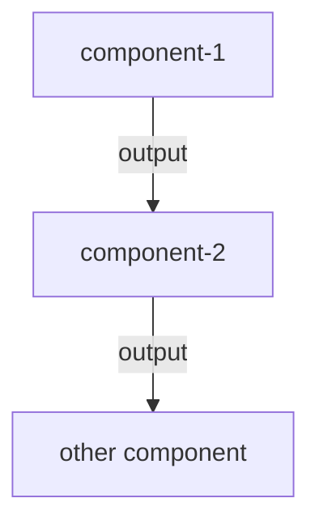

<h1 align="center">FINAM paper: Bi-directional toy-model</h1>

## Description
Instead of a common one directional model. A bidirectional model in FINAM interconnects components for every time step. Component-1 takes the output of component-2 as input, while component-2 takes the output of component-1 as input. (see figures below).

**Bidirectional model**

**One way directional model**

To show bidirectionality in FINAM, six components were created, which provide a basic representation of the interactions between precipitation, Leaf Area Index (LAI), and soil moisture (SM). The goal of this bidirectional model is to illustrate the functionality of bidirectionality in FINAM, rather than serving as a physical model that relates precipitation, LAI, and SM.

The following five components were implemented:

- `pre component`: related to the input precipitation.
- `sm_bi component`: calculates the soil moisture (SM) for a bi-directional model.
- `lai_bi component`: calculates Leaf Area Index (LAI) for a bi-directional model.
- `sm_constant_lai component`: calculates the soil moisture (SM) for a non bi-directional model.
- `constant_lai component`: calculates Leaf Area Index (LAI) for a non bi-directional model.
- `plot component`: Depicts the results on a graph

There are two pairs of components related to SM and LAI. The first pair consists of the `sm_bi component` and the `lai_bi component`, which calculates SM using bidirectionality. The second pair includes the `sm_constant_lai component` and the `constant_lai component`, which utilize a constant value for LAI.

The simulation period is from `1989-01-01` to `1993-12-31` with a daily time step.

## Input precipitation

The input precipitation data (`pre.nc`) used was obtained from `test_domain` in the mesoscale hydrologic model ([mHM](https://mhm.pages.ufz.de/mhm/stable/)). NetCDF file available [here](https://git.ufz.de/mhm/mhm/-/tree/develop/test_domain/input/meteo/pre).

In Python, using xarray, pandas, and numpy, the data from the `pre.nc` file was extracted for the coordinates `(xc=3973369.0, yc=2951847.0)`. The data was stored as a CSV file named `pre.csv`. Then, FINAM CsvReader was implemented to add this data to the bidirectional model.

## Equations used in the toy model

### Estimating Leaf Area Index (LAI):
$$ lai(t+1) = A*lai(t) + {(1 - A) * f(sm(t))} $$

Where:
- $lai(t+1)$ = Leaf are index of the next time step (dimensionless).
- $A$ is a constant number to account for the relationship between LAI and SM.
- $lai(t)$ = Leaf are index of the current time step (dimensionless).
- The function $f(sm(t))$ calculates the soil moisture value at a time $t$ by performing linear interpolation using the `numpy.interp` function. In this interpolation, the x-coordinates of the data points a were defined as $xp = [0.0, 0.6, 1]$, and the corresponding y-coordinates were defined as $fp = [0, 5, 3]$.
- $sm(t)$ = Soil moisture of the previous time step (dimensionless).

### Estimating Soil moisture (SM):
$$ sm(t+1) = sm(t) + (B * pre(t)) - (C * lai(t))$$

Where:

- $sm(t)$ = Soil moisture of the next time step (dimensionless).
- $sm(t)$ = Soil moisture of the current time step (dimensionless).
- $pre(t)$ = Rainfall of the current time step (mm/day).
- $lai(t)$ = Leaf are index of the current time step (dimensionless).
- $B$ = Constant to account for the influence of the precipitation over the soil moisture (dimensionless).
- $C$ = Constant to account for the soil type and vegetation characteristics (dimensionless).

`np.clip` was used within the SM equation previously presented to ensure limit values of $sm(t+1)$ between 0 and 1.
